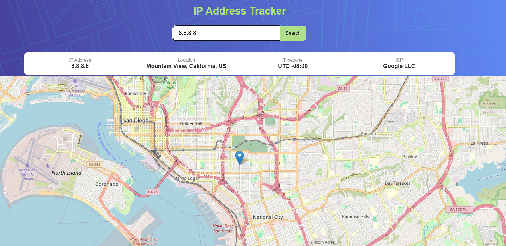

### IP Address Tracker (React)

This project is a React-based IP Address Tracker that allows users to search for an IP address or domain and view its geographic location on an interactive map. The application uses the IPify Geolocation API to retrieve location data and LeafletJS to render the map.

The project focuses on building a responsive, component-based React application that integrates external APIs and handles asynchronous data fetching efficiently.

## Live Demo

## Screenshots

# Live Site
https://ip-address-track-app.netlify.app/

# GitHub Repository
https://github.com/ritanayak/ip-address-tracker

## Project Overview

The IP Address Tracker displays geographic information about an IP address including:

  * IP Address

  * Location (City, Region, Country)

  * Timezone

  * Internet Service Provider (ISP)

The application also renders an interactive map showing the exact location using latitude and longitude coordinates.

# Users can:

  * Search for any IP address

  * Search for a domain name

  * View the location information

  * See the location marker update dynamically on the map

On initial load, the application automatically detects the user's current IP address location.

# Features

  * Search for IP addresses or domain names

  * Display location information

  * Interactive LeafletJS map

  * Custom map marker

  * Responsive design for mobile and desktop

  * Error handling for invalid input

  * Loading states for API requests

  * Clean and reusable React component architecture

# Built With

  * React

  * JavaScript (ES6+)

  * React Hooks (useState, useEffect)

  * Custom React Hooks

  * CSS3 (Flexbox + Grid)

  * LeafletJS

  * IPify Geolocation API

  * Netlify (Deployment)

## Project Architecture

The project uses a component-based structure where each UI section is separated into reusable components.

Main components:

 * SearchForm

     Handles user input and triggers the IP search.

 * InfoPanel

     Displays IP information such as location, timezone, and ISP.

 * MapView
    Displays the Leaflet map and updates the marker position.

 * useIPData (Custom Hook)
     Responsible for fetching IP geolocation data from the API.

This structure helps separate UI logic from data-fetching logic, making the application easier to maintain and scale.

# Folder Structure

src
 ├── components
 │   ├── SearchForm.jsx
 │   ├── InfoPanel.jsx
 │   └── MapView.jsx
 │
 ├── hooks
 │   └── useIPData.js
 │
 ├── assets
 │   └── images
 │
 ├── App.jsx
 ├── main.jsx
 ├── index.css
 └── App.css

# API Integration

The application retrieves IP location data from the IPify Geolocation API.

# Example API request:

https://geo.ipify.org/api/v2/country,city?apiKey=YOUR_API_KEY&ipAddress=IP_ADDRESS

# The API returns data such as:

   * IP address

   * ISP

   * City

   * Region

   * Country

   * Latitude

   * Longitude

   * Timezone

This information is used to update the information panel and map location.

## Example Custom Hook

The useIPData hook handles asynchronous API requests and manages loading and error states.

function useIPData(query) {
  const [data, setData] = useState(null);
  const [loading, setLoading] = useState(false);
  const [error, setError] = useState(null);

  useEffect(() => {
    if (!query) return;

    setLoading(true);

    fetch(`https://geo.ipify.org/api/v2/country,city?apiKey=API_KEY&ipAddress=${query}`)
      .then(res => res.json())
      .then(result => {
        setData(result);
        setLoading(false);
      })
      .catch(() => {
        setError("Unable to fetch data");
        setLoading(false);
      });
  }, [query]);

  return { data, loading, error };
}

This hook keeps the API logic separate from UI components, improving code readability and reusability.

## Responsive Design

The application follows a mobile-first design approach.

Responsive behavior includes:

  * Vertical layout for mobile screens

  * Horizontal info panel layout for desktop

  * Responsive map resizing

  * Flexible input and button layout

CSS Grid and Flexbox are used to manage layout changes across screen sizes.

